### 

# **Hollow-Bot:**

# **Proyecto de Inteligencia Artificial para Hollow Knight**

  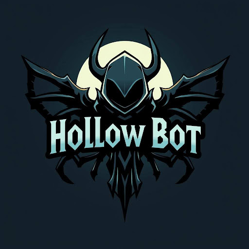

**ÍNDICE**

[**Introducción**](#introducción)

[Breve descripción del videojuego Hollow Knight](#breve-descripción-del-videojuego-hollow-knight)

[Objetivo del proyecto](#objetivo-del-proyecto)

[La aplicación de la IA en este proyecto](#la-aplicación-de-la-ia-en-este-proyecto)

[**Metodología**](#metodología)

[Adquisición y Preprocesamiento de Datos](#adquisición-y-preprocesamiento-de-datos)

[Selección y Entrenamiento del Modelo](#selección-y-entrenamiento-del-modelo)

[Reconocimiento de voz](#reconocimiento-de-voz)

[Estudio de la amenaza](#estudio-de-la-amenaza)

[Entorno e Interfaz](#entorno-e-interfaz)

[Métricas de Evaluación](#métricas-de-evaluación)

[**Resultados**](#resultados)

[Modelo YOLO para la detección del personaje principal](#modelo-yolo-para-la-detección-del-personaje-principal)

[Modelo YOLO para la detección del jefe y sus ataques](#modelo-yolo-para-la-detección-del-jefe-y-sus-ataques)

[Modelo KERAS para la predicción del sentido del ataque ‘ray\_from\_above’](#modelo-keras-para-la-predicción-del-sentido-del-ataque-ray_from_above)

[**Conclusiones**](#conclusiones)

[**Apéndices**](#apéndices)

[Fragmentos de código](#fragmentos-de-código)

[Visualizaciones de datos adicionales](#visualizaciones-de-datos-adicionales)

[Modelo YOLO para la detección del personaje principal](#modelo-yolo-para-la-detección-del-personaje-principal)

[Modelo YOLO para la detección del jefe y sus ataques](#modelo-yolo-para-la-detección-del-jefe-y-sus-ataques)

[**Repositorio**](#repositorio)

# Introducción. 

Hollow Knight es un videojuego de plataformas y acción conocido por su dificultad elevada y su estilo artístico distintivo. Enfrentar a los jefes del Panteón representa un reto significativo incluso para jugadores experimentados. Este proyecto propone el desarrollo de un bot con inteligencia artificial (IA) que pueda aprender de manera autónoma a combatir y vencer uno a estos jefes. Mediante el uso de técnicas de aprendizaje automático captura de imagen, se busca entrenar a un agente capaz de identificar los diferentes personajes del videojuego..

### Breve descripción del videojuego *Hollow Knight*.

**Hollow Knight** es un videojuego de acción y aventura del tipo *Metroidvania*, desarrollado por el estudio independiente Team Cherry. Lanzado en 2017, el juego se desarrolla en *Hallownest*, un vasto reino subterráneo en ruinas habitado por insectos y criaturas extrañas.

El jugador controla a un pequeño y silencioso caballero que explora este mundo interconectado, enfrentando enemigos, jefes desafiantes y descubriendo secretos ocultos. 

El juego destaca por su atmósfera melancólica, su estilo artístico dibujado a mano y una banda sonora envolvente. También es conocido por su elevada dificultad y su profunda narrativa ambiental, que se revela a través de la exploración y el descubrimiento.

### Objetivo del proyecto.

El objetivo inicial de este proyecto es ambicioso: diseñar, desarrollar e implementar un bot basado en aprendizaje automático supervisado capaz de derrotar a todos los jefes del Panteón en el videojuego Hollow Knight. Esto implica entrenar un modelo de inteligencia artificial para la identificación de múltiples jefes y sus diversos patrones de ataque, y programar las acciones del personaje del jugador de forma adaptable a cada encuentro, utilizando una interfaz de activación y la librería PyAutoGUI para la interacción con el juego. La visión es crear un agente autónomo integral capaz de superar la totalidad de los desafíos que presentan los jefes del Panteón.  
Sin embargo, dada la considerable complejidad que supondría abordar la totalidad de los jefes del juego, con sus variados comportamientos y mecánicas de combate únicas, se tomó la decisión estratégica de focalizar el desarrollo en un único enemigo: el Cristal Boss. El objetivo principal se redefinió entonces para diseñar, desarrollar e implementar un bot específicamente adaptado para derrotar al Cristal Boss. Esto permite una mayor concentración de esfuerzos en el entrenamiento de modelos precisos para este jefe en particular y en la programación de estrategias de combate optimizadas contra sus ataques específicos. El resultado esperado es un agente autónomo altamente competente para superar el desafío que presenta el Cristal Boss en Hollow Knight.

### La aplicación de la IA en este proyecto.

**Desafío complejo:** Derrotar al jefe a los jefes del Panteón en Hollow Knight representa un desafío complejo para un agente de IA, ya que requiere precisión, sincronización y adaptabilidad a diferentes patrones de ataque.

**Potencial para la optimización:** El desarrollo de un bot capaz de jugar Hollow Knight puede conducir a nuevas estrategias y técnicas de optimización dentro del juego, lo que podría ser de interés tanto para la comunidad de jugadores como para los desarrolladores de juegos.

**Demostración de habilidades:** Este proyecto sirve como una demostración práctica de la aplicación de conceptos de IA y Big Data en un escenario del mundo real, destacando las habilidades del equipo de desarrollo en áreas como el diseño de modelos, el entrenamiento de algoritmos y la ingeniería de software.

# Metodología. 

Esta sección describe en detalle el enfoque técnico adoptado para el desarrollo de Hollow-Bot, abarcando la adquisición y el preprocesamiento de datos, la selección y el entrenamiento de modelos de aprendizaje automático, y el diseño del entorno e interfaz del bot.

### Adquisición y Preprocesamiento de Datos.

La adquisición y el preprocesamiento de datos para el entrenamiento de los modelos de visión por computador se iniciaron con la captura de fotogramas de los enfrentamientos contra los jefes del juego. Para lograr esto, se empleó la librería ***pygetwindow*** de Python. La elección de la misma se basó en su capacidad para interactuar directamente con las ventanas del sistema operativo, permitiendo una captura eficiente y precisa de la ventana del juego, y el almacenamiento de cada fotograma como una imagen individual en formato PNG.

Este formato se seleccionó por su amplia compatibilidad y su naturaleza sin pérdida, asegurando la preservación de la calidad de la imagen, lo cual es crucial para el análisis detallado de los fotogramas. Este proceso resultó en un extenso conjunto de datos de imágenes representativas de diversas situaciones de combate. 

Posteriormente, se procedió al etiquetado de los elementos relevantes dentro de cada fotograma mediante el programa ***labelme***. La selección de éste se fundamentó en su interfaz gráfica intuitiva, que facilita el etiquetado manual preciso de objetos en imágenes, permitiendo marcar la posición del personaje principal, la ubicación del jefe y la extensión de sus ataques de forma fácil. 

Cada etiqueta, junto con sus coordenadas, se guardó en un archivo JSON asociado a cada imagen. Finalmente, para asegurar la compatibilidad de las etiquetas con el formato de entrada requerido por los modelos *YOLO*, se realizó una transformación de los archivos JSON al formato TXT. ,ya que *YOLO* requiere que las etiquetas estén en formato TXT, por lo que esta conversión fue un paso necesario para integrar los datos etiquetados en el flujo de trabajo de entrenamiento del modelo. Este proceso de preprocesamiento aseguró que los datos estuvieran en un formato adecuado para el entrenamiento eficiente de los modelos de detección de objetos.

### Selección y Entrenamiento del Modelo.

En cuanto a la selección y el entrenamiento del modelo, se optó por la arquitectura ***YOLO*** (You Only Look Once) para la detección de objetos en los fotogramas del juego. La elección del mismo se debió a su equilibrio entre velocidad y precisión, lo que lo hace adecuado para la detección de objetos en tiempo real, un requisito esencial para que el bot reaccione eficazmente a las acciones del juego. Se entrenaron dos modelos YOLO independientes, uno dedicado a la detección del personaje principal y el otro a la detección del jefe y sus ataques. Esta decisión de utilizar modelos separados permitió una especialización y optimización para cada tipo de objeto, mejorando la precisión de la detección en comparación con un único modelo. Adicionalmente, se implementó un modelo ***Keras***, proporcionado por la librería ***TensorFlow*** de Python, para la predicción de la dirección de los ataques del jefe. Keras/TensorFlow se eligió por su amplia adopción en la comunidad de aprendizaje automático, su flexibilidad para construir y entrenar diversos tipos de modelos, y su eficiencia en el manejo de operaciones numéricas complejas, necesarias para la predicción de trayectorias. Este modelo se entrenó con los datos etiquetados para predecir la trayectoria de uno de los ataques, una capacidad crucial para permitir al bot anticiparse y reaccionar adecuadamente.

### Reconocimiento de voz.

Para implementar el reconocimiento de voz en esta aplicación, se ha utilizado la librería speech_recognition de Python, la cual permite convertir audio del micrófono en texto. Esta conversión se realiza a través del servicio de reconocimiento de voz de Google, que ofrece una transcripción bastante precisa siempre y cuando se cuente con una conexión estable a Internet.  
El proceso comienza capturando el audio mediante el micrófono del dispositivo. Antes de iniciar la escucha, se emplea la función adjust_for_ambient_noise, que calibra automáticamente el micrófono para reducir el impacto del ruido ambiental, mejorando así la calidad del reconocimiento.  
Una vez que el usuario pronuncia una frase, el sistema compara el texto transcrito con una frase clave predefinida (por ejemplo, "Inicia"). Si hay coincidencia, se interpreta como una orden válida y el programa continúa su ejecución. En caso contrario, se repite el proceso hasta detectar correctamente la frase esperada.  
Una limitación de este enfoque es la dependencia de una conexión a Internet, ya que el motor de reconocimiento de Google no funciona de manera local. Esto puede representar un inconveniente en entornos sin acceso a la red o con conectividad inestable.  

### Estudio de la amenaza.

El cálculo del porcentaje de amenaza se realiza en tiempo real analizando varios factores extraídos de la imagen del juego mediante los modelos de aprendizaje automático. El proceso comienza con la detección de la posición del personaje principal y del jefe utilizando modelos YOLO independientes. También se detectan los ataques del jefe, distinguiendo entre rayos verticales y horizontales.   
La amenaza se evalúa considerando principalmente la proximidad del jefe al personaje. Para cuantificar esto, se calcula la distancia euclídea entre los centros de las cajas delimitadoras del personaje y el jefe. Esta distancia se normaliza a un rango de 0 a 1, donde 1 indica una proximidad máxima. Cuanto menor es la distancia, mayor es la amenaza asociada a la cercanía del jefe.  
Además de la proximidad general, se evalúa la amenaza específica de los ataques del jefe. Se calcula la distancia mínima entre el personaje y cualquier rayo vertical u horizontal detectado. Estas distancias también se normalizan a un rango de 0 a 1, de manera similar a la distancia con el jefe. La presencia cercana de un ataque incrementa significativamente el nivel de amenaza.  
Un componente adicional en el cálculo de la amenaza, y que aprovecha el modelo Keras, es la predicción de la dirección de los rayos verticales. Una vez detectado un rayo vertical, se utiliza el modelo Keras para predecir si el personaje debería moverse a la izquierda o a la derecha para evitarlo. Se introduce un factor de "castigo" en el cálculo de la amenaza si la posición actual del personaje con respecto al rayo sugiere que se está moviendo en la dirección incorrecta predicha por el modelo Keras. Este castigo incrementa la amenaza, reflejando un mayor riesgo para el personaje.  
Finalmente, todos estos factores individuales se combinan mediante una suma ponderada para obtener un único porcentaje de amenaza, teniendo los rayos verticales tienen una ponderación del 40%, los rayos horizontales del 30%, la distancia al jefe del 10%, y el factor de castigo de la dirección del 20%. El resultado final se escala a un porcentaje entre 0 y 100, proporcionando una indicación intuitiva del nivel de peligro que enfrenta el personaje en cada instante del juego. Este porcentaje de amenaza se muestra en la interfaz gráfica para el usuario.  

### Entorno e Interfaz.

El entorno e interfaz se desarrolló mediante una interfaz gráfica de usuario (GUI) creada con la librería ***tkinter*** de Python. La selección de ésta se basó en su inclusión en la biblioteca estándar de Python, lo que simplifica la distribución del programa y evita dependencias externas, además de su facilidad de uso para crear interfaces gráficas básicas. Esta interfaz permite al usuario iniciar y detener la ejecución del bot de manera sencilla, y además, muestra información relevante sobre el estado del juego, incluyendo una visualización del "porcentaje de amenaza" que representa el jefe para el personaje principal en cada momento. Esta métrica, calculada a partir de la proximidad y el tipo de ataque del jefe, proporciona una indicación en tiempo real del peligro que enfrenta el personaje principal, lo cual es útil para la toma de decisiones y el análisis del comportamiento del mismo.

### Métricas de Evaluación.

Finalmente, para evaluar el rendimiento del sistema, se emplearon diversas métricas adaptadas a las diferentes etapas del proceso. Para los modelos YOLO, encargados de la detección de objetos, se calcularon la <b>*precisión*</b> y el <b>*recall*</b>. La precisión se utilizó para medir la proporción de detecciones realizadas por el modelo que eran correctas, es decir, la fracción de objetos detectados que realmente corresponden al personaje principal o a los ataques del jefe. El recall, por otro lado, se empleó para medir la proporción de objetos reales presentes en las imágenes que fueron detectados correctamente por el modelo, es decir, la fracción del personaje principal, el jefe y sus ataques que el modelo logró identificar. Ambas métricas fueron cruciales para caracterizar la capacidad de los modelos YOLO para detectar correctamente los objetos de interés, minimizando tanto los falsos positivos como los falsos negativos.  
En cuanto al modelo Keras, responsable de la predicción de la dirección de uno de los ataques del jefe, se utilizó la <b>*exactitud*</b> como métrica principal. La exactitud se definió como la proporción de predicciones de dirección realizadas por el modelo que coincidían con la dirección real del ataque. Esta métrica proporcionó una medida directa de la habilidad del modelo para predecir con precisión la trayectoria del ataque, lo cual es fundamental para la capacidad del bot de anticiparse a los movimientos del enemigo.

# Resultados

### Modelo YOLO para la detección del personaje principal. 

Los resultados del entrenamiento del modelo YOLO para la detección del personaje principal se presentan en la [Tabla 1](#tabla-1--resultados-del-entrenamiento-del-modelo-yolo-para-la-detección-del-personaje-principa), la [Figura 1](#figura-1-curva-de-precisión-recall-pr-del-modelo-yolo-para-la-detección-del-personaje-principal), la [Figura 2](#figura-2-matriz-de-confusión-del-modelo-yolo-para-la-detección-del-personaje-principal) y la [Figura 3](#figura-3-ejemplos-de-imágenes-del-conjunto-de-validación-con-las-detecciones-del-modelo-yolo-para-la-detección-del-personaje-principal).

En la [Tabla 1](#tabla-1--resultados-del-entrenamiento-del-modelo-yolo-para-la-detección-del-personaje-principa) vemos que las métricas clave utilizadas para evaluar el rendimiento del modelo fueron la **precisión** (columna precision(B)), el **recall** (columna recall(B)), y el **mAP** (columnas mAP50(B) y mAP50-95(B)). 

A lo largo del entrenamiento, se observó una tendencia general al alza tanto en la precisión como en el recall, lo que indica que el modelo fue mejorando su capacidad para detectar correctamente al personaje principal. Por ejemplo, la precisión aumentó de 0.00266 en la primera época a 1 en varias épocas donde alcanzó el máximo. De manera similar, el recall pasó de 0.7972 a 0.98601. 

El mAP50-95, una métrica más estricta que considera el rendimiento del modelo en un rango de umbrales de confianza, también mostró una mejora constante, alcanzando un valor de 0.79758 al final del entrenamiento. Esto sugiere que el modelo no solo mejoró en la detección del personaje, sino también en la asignación de puntuaciones de confianza precisas a sus detecciones. 

La **curva Precisión-Recall** ([Figura 1](#figura-1-curva-de-precisión-recall-pr-del-modelo-yolo-para-la-detección-del-personaje-principal)) muestra la relación entre estas dos métricas, ilustrando el compromiso entre la reducción de falsos positivos y la detección de todos los objetos relevantes. En este caso particular, la curva demuestra un rendimiento excelente, alcanzando una precisión de 1.0 hasta un recall muy cercano a 1.0, lo que indica que el modelo mantiene una alta precisión incluso al detectar la gran mayoría de los objetos. Además, la gráfica indica una mAP@0.5 de 0.985 para todas las clases, y una precisión de 0.985 para la clase 'character', lo que demuestra aún más el sólido rendimiento del modelo. 

La **matriz de confusión** ([Figura 2](#figura-2-matriz-de-confusión-del-modelo-yolo-para-la-detección-del-personaje-principal)) proporciona un desglose detallado de los errores de clasificación, revelando que el modelo clasificó correctamente 141 instancias como 'character' cuando realmente eran 'character', y solo cometió 2 errores al clasificar instancias de 'background' como 'character', sin errores en la clasificación correcta de 'background'. Esto indica un rendimiento muy alto en la clasificación de 'character' y un excelente manejo de la distinción entre 'character' y 'background'. 

La [Figura 3](#figura-3-ejemplos-de-imágenes-del-conjunto-de-validación-con-las-detecciones-del-modelo-yolo-para-la-detección-del-personaje-principal) presenta una serie de doce **imágenes del conjunto de validación**, mostrando escenas del videojuego Hollow Knight con las detecciones del modelo superpuestas. En general, se puede observar un buen rendimiento del modelo en la detección del personaje principal, indicado por los recuadros azules etiquetados como "character" con altos niveles de confianza, como 0.9 y 0.8. La mayoría de las imágenes muestran detecciones precisas del personaje en diversas poses y ubicaciones dentro de los escenarios del juego, con los recuadros azules ajustándose estrechamente al contorno del personaje y la confianza alta sugiriendo que el modelo está seguro de sus predicciones. No se observan errores de detección obvios, como falsos positivos o falsos negativos. 

### Tabla 1 : Resultados del entrenamiento del modelo YOLO para la detección del personaje principa 

| epoch | time | train/box\_loss | train/cls\_loss | train/dfl\_loss | precision(B) | recall(B) | mAP50(B) | mAP50-95(B) | val/box\_loss | val/cls\_loss | val/dfl\_loss | lr/pg0 | lr/pg1 | lr/pg2 |
| :---: | :---: | :---: | :---: | :---: | :---: | :---: | :---: | :---: | :---: | :---: | :---: | :---: | :---: | :---: |
| 1 | 543.77 | 1.5926 | 3.13352 | 1.13953 | 0.00266 | 0.7972 | 0.00492 | 0.00201 | 1.31553 | 4.21603 | 1.05202 | 0.000648148 | 0.000648148 | 0.000648148 |
| 2 | 1062.2 | 1.4441 | 1.72368 | 1.08549 | 1 | 0.13628 | 0.83474 | 0.54336 | 1.34012 | 3.02024 | 1.1361 | 0.00128878 | 0.00128878 | 0.00128878 |
| 3 | 1582.19 | 1.38179 | 1.58535 | 1.06602 | 0.99177 | 0.84296 | 0.94566 | 0.60571 | 1.32239 | 1.95621 | 1.09563 | 0.00190301 | 0.00190301 | 0.00190301 |
| 4 | 2100.62 | 1.34651 | 1.25499 | 1.06611 | 0.95841 | 0.90909 | 0.95256 | 0.62014 | 1.35006 | 1.38425 | 1.09873 | 0.0018812 | 0.0018812 | 0.0018812 |
| 5 | 2617.9 | 1.30241 | 1.06387 | 1.02519 | 0.9238 | 0.93256 | 0.96863 | 0.64241 | 1.24511 | 1.0988 | 1.07842 | 0.0018416 | 0.0018416 | 0.0018416 |
| 6 | 3143.21 | 1.22796 | 0.93774 | 1.03012 | 0.96922 | 0.92308 | 0.96827 | 0.6597 | 1.14932 | 0.91196 | 1.00272 | 0.001802 | 0.001802 | 0.001802 |
| 7 | 3660.34 | 1.26037 | 0.87886 | 1.0107 | 0.98423 | 0.93706 | 0.96895 | 0.66102 | 1.17994 | 0.87082 | 1.02835 | 0.0017624 | 0.0017624 | 0.0017624 |
| 8 | 4177.32 | 1.1912 | 0.78896 | 0.99607 | 0.96469 | 0.96503 | 0.97627 | 0.70219 | 1.06272 | 0.75407 | 0.98523 | 0.0017228 | 0.0017228 | 0.0017228 |
| 9 | 4695.32 | 1.14339 | 0.74731 | 0.98676 | 0.93602 | 0.91608 | 0.97869 | 0.69138 | 1.06495 | 0.72661 | 0.98957 | 0.0016832 | 0.0016832 | 0.0016832 |
| 10 | 5212.43 | 1.17376 | 0.73 | 0.99946 | 0.98516 | 0.92863 | 0.96637 | 0.69088 | 1.06987 | 0.70181 | 0.97326 | 0.0016436 | 0.0016436 | 0.0016436 |
| 11 | 5728.47 | 1.18042 | 0.70687 | 0.99423 | 0.98558 | 0.95611 | 0.98339 | 0.70571 | 1.04405 | 0.64879 | 0.96128 | 0.001604 | 0.001604 | 0.001604 |
| 12 | 6244.4 | 1.14639 | 0.66096 | 0.97278 | 0.9928 | 0.96395 | 0.98322 | 0.6869 | 1.12706 | 0.64689 | 0.99937 | 0.0015644 | 0.0015644 | 0.0015644 |
| 13 | 6760.57 | 1.12846 | 0.67575 | 0.98491 | 1 | 0.97062 | 0.98552 | 0.6725 | 1.15827 | 0.61266 | 1.01198 | 0.0015248 | 0.0015248 | 0.0015248 |
| 14 | 7278.76 | 1.09900 | 0.65539 | 0.96033 | 0.96447 | 0.94924 | 0.97416 | 0.71429 | 1.06894 | 0.71874 | 0.9832 | 0.0014852 | 0.0014852 | 0.0014852 |
| 15 | 7798.94 | 1.09569 | 0.62922 | 0.95667 | 0.99288 | 0.97525 | 0.98585 | 0.72669 | 1.03629 | 0.71600 | 0.96943 | 0.0014456 | 0.0014456 | 0.0014456 |
| 16 | 8315.45 | 1.06072 | 0.59888 | 0.94087 | 0.99242 | 0.96503 | 0.98368 | 0.73591 | 1.03147 | 0.5623 | 0.95400 | 0.001406 | 0.001406 | 0.001406 |
| 17 | 8834.94 | 1.06556 | 0.59427 | 0.95155 | 0.9786 | 0.95919 | 0.97828 | 0.73303 | 1.00972 | 0.52565 | 0.95916 | 0.0013664 | 0.0013664 | 0.0013664 |
| 18 | 9358.68 | 1.09674 | 0.60833 | 0.95873 | 0.97205 | 0.97294 | 0.98274 | 0.74318 | 1.0398 | 0.53842 | 0.97101 | 0.0013268 | 0.0013268 | 0.0013268 |
| 19 | 9878.23 | 1.05315 | 0.57333 | 0.94345 | 0.99285 | 0.97064 | 0.9865 | 0.74671 | 0.96892 | 0.52831 | 0.94888 | 0.0012872 | 0.0012872 | 0.0012872 |
| 20 | 10391.3 | 1.07351 | 0.5884 | 0.94598 | 0.99799 | 0.96503 | 0.98827 | 0.76033 | 0.96121 | 0.51504 | 0.95737 | 0.0012476 | 0.0012476 | 0.0012476 |
| 21 | 10899.2 | 1.02929 | 0.55747 | 0.9297 | 0.98508 | 0.97203 | 0.98467 | 0.75972 | 0.95988 | 0.5156 | 0.96275 | 0.001208 | 0.001208 | 0.001208 |
| 22 | 11409.6 | 1.0224 | 0.5436 | 0.94193 | 0.99172 | 0.97203 | 0.9895 | 0.7731 | 0.9272 | 0.51088 | 0.93745 | 0.0011684 | 0.0011684 | 0.0011684 |
| 23 | 11922.9 | 1.0364 | 0.54384 | 0.93468 | 0.96525 | 0.96503 | 0.98274 | 0.74357 | 0.99188 | 0.52493 | 0.94897 | 0.0011288 | 0.0011288 | 0.0011288 |
| 24 | 12433.2 | 1.03395 | 0.55392 | 0.94147 | 0.98542 | 0.94555 | 0.98095 | 0.72681 | 1.05902 | 0.55088 | 0.96152 | 0.0010892 | 0.0010892 | 0.0010892 |
| 25 | 12945.1 | 1.00343 | 0.54054 | 0.93411 | 0.99279 | 0.96264 | 0.97668 | 0.74229 | 0.98997 | 0.50541 | 0.96079 | 0.0010496 | 0.0010496 | 0.0010496 |
| 26 | 13454.5 | 1.01354 | 0.52424 | 0.94266 | 1 | 0.96486 | 0.98236 | 0.75705 | 1.00267 | 0.49485 | 0.95066 | 0.00101 | 0.00101 | 0.00101 |
| 27 | 13964.2 | 0.98967 | 0.52071 | 0.92342 | 0.99047 | 0.97902 | 0.99045 | 0.75359 | 0.92215 | 0.48039 | 0.93294 | 0.0009704 | 0.0009704 | 0.0009704 |
| 28 | 14473.4 | 0.97055 | 0.51192 | 0.9261 | 0.99289 | 0.97713 | 0.97964 | 0.76173 | 0.92228 | 0.4739 | 0.94837 | 0.0009308 | 0.0009308 | 0.0009308 |
| 29 | 14983 | 0.95538 | 0.50996 | 0.92951 | 0.9929 | 0.97795 | 0.98488 | 0.77165 | 0.97394 | 0.45778 | 0.9526 | 0.0008912 | 0.0008912 | 0.0008912 |
| 30 | 15494.8 | 0.95346 | 0.49476 | 0.91104 | 0.99967 | 0.98601 | 0.98702 | 0.76862 | 0.91717 | 0.45176 | 0.93295 | 0.0008516 | 0.0008516 | 0.0008516 |
| 31 | 16003.1 | 0.93087 | 0.48417 | 0.9177 | 0.99994 | 0.97902 | 0.99053 | 0.78575 | 0.93827 | 0.45804 | 0.93991 | 0.000812 | 0.000812 | 0.000812 |
| 32 | 16511.5 | 0.93611 | 0.48705 | 0.91145 | 0.98939 | 0.96503 | 0.98003 | 0.76097 | 0.92411 | 0.45236 | 0.93078 | 0.0007724 | 0.0007724 | 0.0007724 |
| 33 | 17021.7 | 0.90089 | 0.47863 | 0.90399 | 0.99215 | 0.97902 | 0.98042 | 0.77952 | 0.89975 | 0.42894 | 0.93699 | 0.0007328 | 0.0007328 | 0.0007328 |
| 34 | 17536.9 | 0.90853 | 0.4775 | 0.89694 | 0.99936 | 0.97902 | 0.98873 | 0.78966 | 0.91484 | 0.45646 | 0.92772 | 0.0006932 | 0.0006932 | 0.0006932 |
| 35 | 18046.5 | 0.89542 | 0.4677 | 0.90273 | 0.99881 | 0.97902 | 0.98921 | 0.78052 | 0.92287 | 0.44041 | 0.94053 | 0.0006536 | 0.0006536 | 0.0006536 |
| 36 | 18557 | 0.86038 | 0.4547 | 0.89271 | 1 | 0.98524 | 0.98845 | 0.76805 | 0.93764 | 0.42513 | 0.94266 | 0.000614 | 0.000614 | 0.000614 |
| 37 | 19066 | 0.87316 | 0.45936 | 0.90654 | 1 | 0.98564 | 0.98842 | 0.77267 | 0.91693 | 0.42526 | 0.94242 | 0.0005744 | 0.0005744 | 0.0005744 |
| 38 | 19575.5 | 0.87388 | 0.43954 | 0.88745 | 0.98585 | 0.9747 | 0.98352 | 0.78482 | 0.90239 | 0.42411 | 0.94592 | 0.0005348 | 0.0005348 | 0.0005348 |
| 39 | 20081.1 | 0.88243 | 0.44681 | 0.89256 | 0.99221 | 0.98601 | 0.98893 | 0.78172 | 0.91543 | 0.404000 | 0.94508 | 0.0004952 | 0.0004952 | 0.0004952 |
| 40 | 20588.5 | 0.86053 | 0.43763 | 0.88838 | 1 | 0.98496 | 0.98954 | 0.7889 | 0.88261 | 0.42866 | 0.93452 | 0.0004556 | 0.0004556 | 0.0004556 |
| 41 | 21091.5 | 0.82538 | 0.42279 | 0.90142 | 1 | 0.98523 | 0.99057 | 0.79467 | 0.88566 | 0.41619 | 0.92687 | 0.000416 | 0.000416 | 0.000416 |
| 42 | 21596.5 | 0.79549 | 0.40198 | 0.89468 | 0.99143 | 0.97902 | 0.98207 | 0.79681 | 0.87579 | 0.40666 | 0.92924 | 0.0003764 | 0.0003764 | 0.0003764 |
| 43 | 22099.1 | 0.80495 | 0.40249 | 0.90151 | 0.99155 | 0.97902 | 0.98448 | 0.79269 | 0.88043 | 0.40313 | 0.92292 | 0.0003368 | 0.0003368 | 0.0003368 |
| 44 | 22604.5 | 0.77751 | 0.38498 | 0.89525 | 0.9923 | 0.97902 | 0.98466 | 0.79967 | 0.86765 | 0.39419 | 0.93135 | 0.0002972 | 0.0002972 | 0.0002972 |
| 45 | 23108.9 | 0.75426 | 0.38054 | 0.88989 | 0.99933 | 0.98601 | 0.99031 | 0.78696 | 0.88477 | 0.38716 | 0.93856 | 0.0002576 | 0.0002576 | 0.0002576 |
| 46 | 23613.9 | 0.77315 | 0.37675 | 0.89119 | 0.99881 | 0.98601 | 0.9928 | 0.78926 | 0.90688 | 0.40008 | 0.93541 | 0.000218 | 0.000218 | 0.000218 |
| 47 | 24117.9 | 0.77333 | 0.3797 | 0.89726 | 0.99195 | 0.97902 | 0.98691 | 0.79641 | 0.88901 | 0.39502 | 0.94624 | 0.0001784 | 0.0001784 | 0.0001784 |
| 48 | 24623.1 | 0.76875 | 0.37362 | 0.88427 | 0.99912 | 0.98601 | 0.98992 | 0.79115 | 0.91088 | 0.3933 | 0.94139 | 0.0001388 | 0.0001388 | 0.0001388 |
| 49 | 25128.2 | 0.74073 | 0.36767 | 0.8773 | 0.99204 | 0.97902 | 0.98339 | 0.79521 | 0.89244 | 0.39122 | 0.93644 | 9.92e-05 | 9.92e-05 | 9.92e-05 |
| 50 | 25632.1 | 0.75325 | 0.36616 | 0.88502 | 0.99909 | 0.98601 | 0.98992 | 0.79758 | 0.88125 | 0.38618 | 0.93311 | 5.96e-05 | 5.96e-05 | 5.96e-05 |

### **Figura 1**. Curva de Precisión-Recall (PR) del modelo YOLO para la detección del personaje principal.

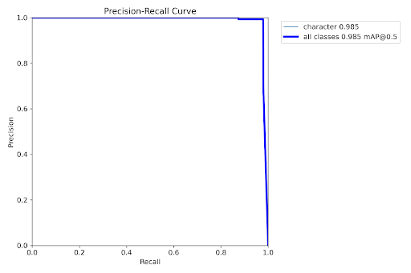

### **Figura 2**. Matriz de confusión del modelo YOLO para la detección del personaje principal.

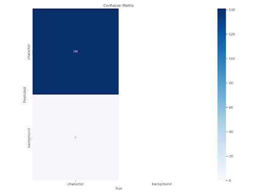

### **Figura 3**. Ejemplos de imágenes del conjunto de validación con las detecciones del modelo YOLO para la detección del personaje principal.

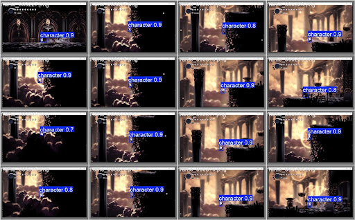

### Modelo YOLO para la detección del jefe y sus ataques. {#modelo-yolo-para-la-detección-del-jefe-y-sus-ataques.}

Los resultados del entrenamiento del modelo YOLO para la detección del jefe y sus ataques se presentan en la [Tabla 2](#tabla-2-resultados-del-entrenamiento-del-modelo-yolo-para-la-detección-del-jefe-y-sus-ataques), la [Figura 4](#figura-4-curva-de-precisión-recall-pr-del-modelo-yolo-para-la-detección-del-jefe-y-sus-ataques), la [Figura 5](#figura-5-matriz-de-confusión-del-modelo-yolo-para-la-detección-del-jefe-y-sus-ataques) y la [Figura 6](#figura-6-ejemplos-de-imágenes-del-conjunto-de-validación-con-las-detecciones-del-modelo-yolo-para-la-detección-del-personaje-principal).

En la [Tabla 2](#tabla-2-resultados-del-entrenamiento-del-modelo-yolo-para-la-detección-del-jefe-y-sus-ataques), las métricas clave utilizadas para evaluar el rendimiento del modelo fueron la **precisión** (columna precision(B)), el **recall** (columna metrics/recall(B)), y el **mAP** (columnas mAP50(B) y mAP50-95(B)). Estas métricas se enfocan específicamente en la capacidad del modelo para detectar al jefe y sus ataques dentro del juego.

A lo largo del entrenamiento, se observó una tendencia general al alza tanto en la precisión como en el recall, lo que indica que el modelo fue mejorando su capacidad para detectar correctamente al jefe y sus ataques. Por ejemplo, la precisión aumentó de 0.85177 en la primera época a 0.96707 en la trigésima época, lo que sugiere que el modelo se volvió más exacto en sus detecciones a medida que avanzaba el entrenamiento. De manera similar, el recall pasó de 0.37382 a 0.83345 en la época 30, lo que indica que el modelo también mejoró en la detección de una mayor proporción de las instancias reales del jefe y sus ataques presentes en las imágenes.

El mAP50-95, una métrica más estricta que considera el rendimiento del modelo en un rango de umbrales de confianza, también mostró una mejora constante, alcanzando un valor de 0.71059 en la época 30\. Esto sugiere que el modelo no solo mejoró en la detección del jefe y sus ataques, sino también en la asignación de puntuaciones de confianza más precisas a sus detecciones, lo cual es crucial para que el bot pueda tomar decisiones confiables basadas en estas detecciones.

La [Figura 4](#figura-4-curva-de-precisión-recall-pr-del-modelo-yolo-para-la-detección-del-jefe-y-sus-ataques) muestra la **curva Precisión-Recall (PR)** para el modelo YOLO, que representa el rendimiento del modelo en la detección del jefe y sus ataques. La curva ilustra la relación entre la precisión (la proporción de detecciones correctas entre todas las detecciones realizadas) y el recall (la proporción de todos los jefes y ataques reales que fueron detectados correctamente).

En general, la gráfica indica un buen rendimiento del modelo, con un mAP@0.5 (mean Average Precision a un IoU de 0.5) para todas las clases de 0.897. Esto sugiere que, en promedio, el modelo es capaz de detectar al jefe y sus ataques con una precisión y un recall relativamente altos.

Al observar las curvas individuales para cada clase, se pueden extraer las siguientes conclusiones:

* **'cristal\_boss' (0.995), 'boss\_ray' (0.983) y 'ray\_from\_above' (0.975):** Estas clases muestran curvas PR que se mantienen muy cerca de 1.0 en precisión durante un rango significativo de recall. Esto indica que el modelo es muy efectivo en la detección de estos elementos, con pocos falsos positivos incluso cuando se intenta detectar la mayoría de las instancias. El modelo demuestra una alta capacidad para identificar correctamente al jefe 'cristal\_boss' y para detectar sus ataques 'boss\_ray' y 'ray\_from\_above'.  
* **'base' (0.634):** La curva para esta clase tiene un rendimiento inferior en comparación con las otras clases. La precisión disminuye más rápidamente a medida que aumenta el recall, lo que sugiere que el modelo tiene más dificultades para detectar consistentemente todas las instancias de 'base' sin cometer falsos positivos. Esto indica que 'base' es un elemento más difícil de definir o detectar.

La **matriz de confusión** ([Figura 5](#figura-5-matriz-de-confusión-del-modelo-yolo-para-la-detección-del-jefe-y-sus-ataques)) proporciona un desglose detallado del rendimiento del modelo YOLO en la clasificación de las detecciones del jefe y sus ataques. Cada fila representa las clases predichas por el modelo, mientras que cada columna representa las clases verdaderas (ground truth). Los valores en la matriz indican el número de instancias que pertenecen a una clase verdadera y fueron clasificadas como una clase predicha.

Al analizar la matriz, se pueden obtener las siguientes observaciones clave:

* **Detección precisa de 'cristal\_boss', 'boss\_ray' y 'ray\_from\_above'**: El modelo muestra un alto rendimiento en la detección de estas clases, como se evidencia en los valores altos en la diagonal principal para 'cristal\_boss' (194), 'boss\_ray' (76) y 'ray\_from\_above' (115). Esto indica que la mayoría de las instancias de estos elementos fueron clasificadas correctamente.  
* **Confusión limitada entre clases de ataque**: Se observa una baja confusión entre las clases de ataque ('boss\_ray' y 'ray\_from\_above'), lo que sugiere que el modelo es capaz de distinguirlas con precisión. Solo hay unos pocos errores en los que instancias de una clase de ataque se clasifican incorrectamente como la otra.  
* **Confusión de 'base' con 'background'**: Hay una cantidad notable de confusión entre la clase 'base' y la clase 'background'. De las 88 instancias reales de 'base', 20 se clasificaron erróneamente como 'background'. Además, 51 instancias reales de 'background' se clasificaron erróneamente como 'base'. Esto sugiere que el modelo tiene dificultades para diferenciar claramente entre estos dos elementos. Esto podría deberse a similitudes visuales o a una definición poco clara de lo que constituye 'base' frente a 'background'.  
* **Errores mínimos con 'background**': En general, el modelo comete pocos errores al clasificar instancias de 'cristal\_boss', 'boss\_ray' y 'ray\_from\_above' como 'background', lo que indica que estos elementos son bastante distintos del fondo.

La [Figura 6](#figura-6-ejemplos-de-imágenes-del-conjunto-de-validación-con-las-detecciones-del-modelo-yolo-para-la-detección-del-personaje-principal) muestra una serie de doce imágenes del conjunto de validación, presentando ejemplos visuales de las detecciones del modelo YOLO sobre fotogramas del videojuego Hollow Knight. Estas imágenes ofrecen una perspectiva cualitativa del rendimiento del modelo en la tarea de detectar al jefe y sus ataques.

En términos generales, el modelo muestra una capacidad razonable para identificar al jefe, denominado 'cristal\_boss', y algunos de sus ataques, como 'boss\_ray' y 'ray\_from\_above'. Sin embargo, se observan ciertas inconsistencias y áreas donde el modelo podría mejorar.

La detección del jefe, 'cristal\_boss', es bastante consistente en la mayoría de las imágenes, con recuadros azules que generalmente se ajustan bien al contorno del personaje y niveles de confianza alrededor de 0.9. En contraste, la detección de los ataques del jefe es más variable. El ataque 'boss\_ray' se detecta en algunas imágenes, pero con puntajes de confianza a veces más bajos, como 0.3. De manera similar, la detección de 'ray\_from\_above' es menos consistente y los recuadros a veces no se alinean perfectamente con el ataque visual. Además, la etiqueta 'base' tiene unos puntajes de confianza también varían entre las detecciones, lo que indica diferentes niveles de certeza del modelo, posiblemente influenciados por la pose del jefe, la claridad de los ataques o el fondo. Finalmente, en escenas donde el jefe y los ataques están muy cerca o se superponen, las detecciones pueden ser menos precisas o mostrar una confianza más baja.

Debido a los resultados obtenidos sobre la clase ‘base’ que sería la usada para determinar el sentido del ataque ‘ray\_from\_above’, se decidió entrenar un tercer modelo Keras para este fin.

### **Tabla 2**. Resultados del entrenamiento del modelo YOLO para la detección del jefe y sus ataques.

| epoch | time | train/box\_loss | train/cls\_loss | train/dfl\_loss | precision(B) | recall(B) | mAP50(B) | mAP50-95(B) | val/box\_loss | val/cls\_loss | val/dfl\_loss | lr/pg0 | lr/pg1 | lr/pg2 |
| :---: | :---: | :---: | :---: | :---: | :---: | :---: | :---: | :---: | :---: | :---: | :---: | :---: | :---: | :---: |
| 1 | 730024 | 1.70937 | 2.79772 | 1.46378 | 0.85177 | 0.37382 | 0.46059 | 0.28426 | 1.42512 | 3.30129 | 1.29141 | 0.000408163 | 0.000408163 | 0.000408163 |
| 2 | 1438.03 | 1.35983 | 1.64225 | 1.19919 | 0.76175 | 0.55155 | 0.62638 | 0.38499 | 1.36313 | 2.04098 | 1.19017 | 0.000808498 | 0.000808498 | 0.000808498 |
| 3 | 2146.77 | 1.28883 | 1.45582 | 1.15786 | 0.74932 | 0.51549 | 0.66148 | 0.41599 | 1.27556 | 1.61768 | 1.14118 | 0.00119233 | 0.00119233 | 0.00119233 |
| 4 | 2837.61 | 1.21213 | 1.31352 | 1.12301 | 0.66988 | 0.60272 | 0.66435 | 0.41279 | 1.22399 | 1.37342 | 1.13048 | 0.00117575 | 0.00117575 | 0.00117575 |
| 5 | 3509.28 | 1.15986 | 1.18314 | 1.1136 | 0.87481 | 0.64725 | 0.74779 | 0.49184 | 1.09941 | 1.02958 | 1.03871 | 0.001151 | 0.001151 | 0.001151 |
| 6 | 4186.21 | 1.08347 | 1.05987 | 1.07200 | 0.76335 | 0.69691 | 0.73256 | 0.47548 | 1.13122 | 1.00666 | 1.0826 | 0.00112625 | 0.00112625 | 0.00112625 |
| 7 | 4874.35 | 1.04531 | 0.97938 | 1.06074 | 0.88848 | 0.7008 | 0.7836 | 0.52326 | 1.02536 | 0.9241 | 1.02388 | 0.0011015 | 0.0011015 | 0.0011015 |
| 8 | 5572.57 | 1.00812 | 0.91774 | 1.03314 | 0.93121 | 0.73326 | 0.81395 | 0.55279 | 0.96708 | 0.8745 | 0.99062 | 0.00107675 | 0.00107675 | 0.00107675 |
| 9 | 6277.64 | 0.98207 | 0.87464 | 1.03448 | 0.91293 | 0.77443 | 0.83397 | 0.5713 | 0.99392 | 0.82951 | 1.03557 | 0.001052 | 0.001052 | 0.001052 |
| 10 | 6979.55 | 0.96028 | 0.84148 | 1.01582 | 0.94692 | 0.7834 | 0.83016 | 0.58422 | 0.94189 | 0.71885 | 0.95554 | 0.00102725 | 0.00102725 | 0.00102725 |
| 11 | 7682.62 | 0.94807 | 0.79307 | 1.00272 | 0.90289 | 0.78724 | 0.83446 | 0.60999 | 0.93674 | 0.68352 | 0.96114 | 0.0010025 | 0.0010025 | 0.0010025 |
| 12 | 8390.74 | 0.94876 | 0.77659 | 1.00078 | 0.89191 | 0.73753 | 0.82129 | 0.5788 | 0.93844 | 0.73202 | 0.98145 | 0.00097775 | 0.00097775 | 0.00097775 |
| 13 | 9098.57 | 0.88646 | 0.73811 | 0.97931 | 0.89834 | 0.80411 | 0.85191 | 0.61145 | 0.91388 | 0.66931 | 0.96126 | 0.000953 | 0.000953 | 0.000953 |
| 14 | 9806.28 | 0.88204 | 0.72291 | 0.98859 | 0.94658 | 0.80123 | 0.8547 | 0.63777 | 0.85285 | 0.62081 | 0.93834 | 0.00092825 | 0.00092825 | 0.00092825 |
| 15 | 10507.7 | 0.87815 | 0.70357 | 0.97151 | 0.94523 | 0.77733 | 0.85482 | 0.62553 | 0.85151 | 0.60935 | 0.92754 | 0.0009035 | 0.0009035 | 0.0009035 |
| 16 | 11206.9 | 0.82258 | 0.66716 | 0.95178 | 0.96566 | 0.80918 | 0.86941 | 0.63700 | 0.85689 | 0.59694 | 0.92918 | 0.00087875 | 0.00087875 | 0.00087875 |
| 17 | 11899.1 | 0.81544 | 0.64583 | 0.95609 | 0.92414 | 0.81842 | 0.8646 | 0.6446 | 0.82433 | 0.57437 | 0.93797 | 0.000854 | 0.000854 | 0.000854 |
| 18 | 12593.2 | 0.8128 | 0.64619 | 0.95418 | 0.96989 | 0.80468 | 0.85917 | 0.64445 | 0.84300 | 0.58936 | 0.92725 | 0.00082925 | 0.00082925 | 0.00082925 |
| 19 | 13284.6 | 0.81607 | 0.62779 | 0.94963 | 0.93872 | 0.82769 | 0.86638 | 0.66302 | 0.81795 | 0.56883 | 0.92554 | 0.0008045 | 0.0008045 | 0.0008045 |
| 20 | 13979 | 0.78924 | 0.60844 | 0.93849 | 0.96336 | 0.81666 | 0.87776 | 0.64259 | 0.83109 | 0.57294 | 0.92065 | 0.00077975 | 0.00077975 | 0.00077975 |
| 21 | 14685.6 | 0.78657 | 0.60217 | 0.93696 | 0.91277 | 0.82991 | 0.86462 | 0.65193 | 0.82235 | 0.55311 | 0.90841 | 0.000755 | 0.000755 | 0.000755 |
| 22 | 15396.8 | 0.78822 | 0.60386 | 0.9409 | 0.94171 | 0.81349 | 0.87692 | 0.67892 | 0.76096 | 0.53371 | 0.8954 | 0.00073025 | 0.00073025 | 0.00073025 |
| 23 | 16103.1 | 0.75294 | 0.59363 | 0.92676 | 0.96693 | 0.82715 | 0.87228 | 0.66136 | 0.75585 | 0.49623 | 0.89772 | 0.0007055 | 0.0007055 | 0.0007055 |
| 24 | 16814.7 | 0.76802 | 0.58769 | 0.9276 | 0.91021 | 0.8203 | 0.86283 | 0.66778 | 0.79400 | 0.51105 | 0.89534 | 0.00068075 | 0.00068075 | 0.00068075 |
| 25 | 17530.9 | 0.73681 | 0.55695 | 0.91935 | 0.94383 | 0.83906 | 0.88358 | 0.69242 | 0.74606 | 0.4815 | 0.87600 | 0.000656 | 0.000656 | 0.000656 |
| 26 | 18240.4 | 0.72869 | 0.54323 | 0.91700 | 0.92058 | 0.82612 | 0.86983 | 0.70113 | 0.72062 | 0.48168 | 0.87808 | 0.00063125 | 0.00063125 | 0.00063125 |
| 27 | 18973.9 | 0.72345 | 0.54715 | 0.92188 | 0.94086 | 0.83542 | 0.87948 | 0.69728 | 0.70898 | 0.48219 | 0.87582 | 0.0006065 | 0.0006065 | 0.0006065 |
| 28 | 19680.8 | 0.72168 | 0.54926 | 0.91316 | 0.94124 | 0.84621 | 0.87862 | 0.68656 | 0.74489 | 0.4829 | 0.87888 | 0.00058175 | 0.00058175 | 0.00058175 |
| 29 | 20392.5 | 0.70848 | 0.54403 | 0.91375 | 0.95829 | 0.84147 | 0.87966 | 0.70853 | 0.68869 | 0.46875 | 0.87434 | 0.000557 | 0.000557 | 0.000557 |
| 30 | 21097.6 | 0.71422 | 0.53358 | 0.91334 | 0.96707 | 0.83345 | 0.87533 | 0.71059 | 0.67333 | 0.45274 | 0.86817 | 0.00053225 | 0.00053225 | 0.00053225 |
| 31 | 21813.6 | 0.69100 | 0.52028 | 0.91167 | 0.96621 | 0.84548 | 0.88557 | 0.71522 | 0.6848 | 0.43389 | 0.86874 | 0.0005075 | 0.0005075 | 0.0005075 |
| 32 | 22548.1 | 0.68005 | 0.50648 | 0.90257 | 0.96755 | 0.83528 | 0.88431 | 0.71467 | 0.66658 | 0.43046 | 0.85951 | 0.00048275 | 0.00048275 | 0.00048275 |
| 33 | 23266.8 | 0.66074 | 0.50645 | 0.90042 | 0.96687 | 0.84568 | 0.88472 | 0.71202 | 0.66877 | 0.44452 | 0.8575 | 0.000458 | 0.000458 | 0.000458 |
| 34 | 24007.6 | 0.65737 | 0.49862 | 0.90119 | 0.95974 | 0.83159 | 0.88231 | 0.71748 | 0.67497 | 0.44868 | 0.85771 | 0.00043325 | 0.00043325 | 0.00043325 |
| 35 | 24706 | 0.65722 | 0.48894 | 0.89600 | 0.94459 | 0.83011 | 0.8873 | 0.7202 | 0.65547 | 0.42994 | 0.85742 | 0.0004085 | 0.0004085 | 0.0004085 |
| 36 | 25406.4 | 0.64925 | 0.48796 | 0.89385 | 0.95586 | 0.84335 | 0.88652 | 0.72832 | 0.63500 | 0.40501 | 0.86029 | 0.00038375 | 0.00038375 | 0.00038375 |
| 37 | 26109.8 | 0.63646 | 0.48625 | 0.89217 | 0.95095 | 0.84466 | 0.88799 | 0.72986 | 0.63216 | 0.40996 | 0.85697 | 0.000359 | 0.000359 | 0.000359 |
| 38 | 26807.1 | 0.63381 | 0.4742 | 0.89059 | 0.95878 | 0.84304 | 0.88429 | 0.72856 | 0.63955 | 0.42457 | 0.85987 | 0.00033425 | 0.00033425 | 0.00033425 |
| 39 | 27522.3 | 0.62563 | 0.47081 | 0.89012 | 0.92502 | 0.86515 | 0.89169 | 0.73588 | 0.61448 | 0.40103 | 0.85216 | 0.0003095 | 0.0003095 | 0.0003095 |
| 40 | 28227.7 | 0.62275 | 0.46483 | 0.89105 | 0.94636 | 0.8515 | 0.88787 | 0.7374 | 0.61937 | 0.39212 | 0.85105 | 0.00028475 | 0.00028475 | 0.00028475 |
| 41 | 28934.9 | 0.58412 | 0.41886 | 0.85504 | 0.95518 | 0.84821 | 0.88045 | 0.7316 | 0.63635 | 0.42716 | 0.85635 | 0.00026 | 0.00026 | 0.00026 |
| 42 | 29635.3 | 0.55526 | 0.39246 | 0.85383 | 0.94285 | 0.85044 | 0.88665 | 0.74017 | 0.62844 | 0.41327 | 0.85383 | 0.00023525 | 0.00023525 | 0.00023525 |
| 43 | 30332.9 | 0.56986 | 0.39691 | 0.85537 | 0.93173 | 0.85045 | 0.88963 | 0.73363 | 0.63644 | 0.39400 | 0.85551 | 0.0002105 | 0.0002105 | 0.0002105 |
| 44 | 31024.5 | 0.55029 | 0.39 | 0.85464 | 0.9417 | 0.85157 | 0.89015 | 0.7396 | 0.61848 | 0.39377 | 0.86054 | 0.00018575 | 0.00018575 | 0.00018575 |
| 45 | 31712 | 0.53552 | 0.37928 | 0.84895 | 0.93705 | 0.85794 | 0.89452 | 0.7531 | 0.58949 | 0.37826 | 0.85362 | 0.000161 | 0.000161 | 0.000161 |
| 46 | 32408.7 | 0.51994 | 0.37094 | 0.84702 | 0.95066 | 0.85862 | 0.89411 | 0.7546 | 0.58894 | 0.3772 | 0.84848 | 0.00013625 | 0.00013625 | 0.00013625 |
| 47 | 33113.6 | 0.51846 | 0.36315 | 0.8478 | 0.94987 | 0.86547 | 0.89818 | 0.75461 | 0.58665 | 0.37684 | 0.84437 | 0.0001115 | 0.0001115 | 0.0001115 |
| 48 | 33826.5 | 0.50172 | 0.35601 | 0.83646 | 0.94422 | 0.86091 | 0.89601 | 0.75984 | 0.5734 | 0.36339 | 0.8409 | 0,08675 | 0,08675 | 0,08675 |
| 49 | 34526.5 | 0.51214 | 0.35657 | 0.84096 | 0.94793 | 0.85953 | 0.89482 | 0.75794 | 0.57548 | 0.3677 | 0.84142 | 6.2e-05 | 6.2e-05 | 6.2e-05 |
| 50 | 35231.1 | 0.48983 | 0.35007 | 0.83863 | 0.94641 | 0.86100 | 0.89568 | 0.75902 | 0.57249 | 0.36202 | 0.84107 | 0,03725 | 0,03725 | 0,03725 |

### **Figura 4**. Curva de Precisión-Recall (PR) del modelo YOLO para la detección del jefe y sus ataques.

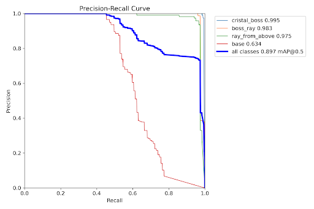

### **Figura 5**. Matriz de confusión del modelo YOLO para la detección del jefe y sus ataques.

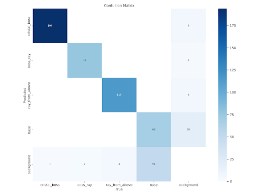

### **Figura 6**. Ejemplos de imágenes del conjunto de validación con las detecciones del modelo YOLO para la detección del personaje principal.

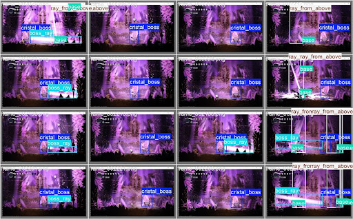

### Modelo KERAS para la predicción del sentido del ataque ‘ray\_from\_above’. 

Los resultados del entrenamiento del modelo KERAS la predicción del sentido del ataque ‘ray\_from\_above’ se presentan en la [Figura 7](#figura-7-curva-de-precisión-recall-pr-del-modelo-keras-para-la-predicción-del-sentido-del-ataque-ray_from_above), la [Figura 8](#figura-8-curva-de-precisión-y-curva-de-pérdida-del-modelo-keras-para-la-predicción-del-sentido-del-ataque-ray_from_above) y la [Figura 9](#figura-9-matriz-de-confusión-del-modelo-keras-para-la-predicción-del-sentido-del-ataque-ray_from_above).

La [Figura 7](#figura-7-curva-de-precisión-recall-pr-del-modelo-keras-para-la-predicción-del-sentido-del-ataque-ray_from_above) muestra la **curva Precisión-Recall** (PR) obtenida del modelo Keras entrenado para predecir el sentido del ataque 'ray\_from\_above'. Esta curva grafica la relación entre la precisión (la proporción de predicciones correctas de la dirección del ataque entre todas las predicciones realizadas para esa dirección) y el recall (la proporción de todas las instancias reales de la dirección del ataque que fueron correctamente predichas por el modelo), variando el umbral de confianza de la predicción.

La curva de color naranja representa el rendimiento del modelo para la tarea de clasificación del sentido del ataque 'ray\_from\_above'. Se observa que la curva se mantiene en valores de precisión muy altos (cercanos a 1.0) para un rango considerable de valores de recall, lo que indica que el modelo es capaz de predecir la dirección del ataque con una alta exactitud, incluso cuando se intenta identificar una porción significativa de todas las instancias del ataque.

El valor del Área Bajo la Curva (AP), indicado en la leyenda como AP \= 0.97, proporciona una métrica resumen del rendimiento del modelo. Un valor de AP cercano a 1.0 sugiere un rendimiento excelente. En este caso, un AP de 0.97 indica que el modelo tiene una gran capacidad para lograr tanto una alta precisión como un alto recall simultáneamente en la tarea de predecir el sentido del ataque 'ray\_from\_above'.

La forma de la curva sugiere que el modelo es robusto y confiable para esta tarea específica. La alta precisión mantenida a medida que aumenta el recall implica que el modelo comete pocos falsos positivos al predecir la dirección del ataque, incluso cuando se intenta detectar la mayoría de las instancias reales. La caída pronunciada al final de la curva, cerca de un recall de 1.0, podría indicar que para alcanzar la detección de todas las instancias del ataque, el modelo comienza a realizar más predicciones incorrectas, lo que disminuye la precisión.

En la [Figura 8](#figura-8-curva-de-precisión-y-curva-de-pérdida-del-modelo-keras-para-la-predicción-del-sentido-del-ataque-ray_from_above) tenemos dos gráficas. En la primera, se muestra la **Precisión** (accuracy) durante el entrenamiento, ilustrando la evolución de la precisión del modelo Keras al predecir la dirección del ataque "ray\_from\_above" a lo largo de las épocas de entrenamiento. La línea azul representa la precisión en el conjunto de entrenamiento, mientras que la línea naranja muestra la precisión en el conjunto de validación. Se observa un incremento notable en la precisión para ambos conjuntos durante las primeras épocas, alcanzando valores superiores al 0.9 rápidamente. La precisión de entrenamiento se mantiene alta y con ligeras fluctuaciones cerca de 1.0 hacia el final del proceso. La precisión de validación sigue una tendencia similar al alza, aunque con algunas variaciones más pronunciadas, estabilizándose también en valores elevados, ligeramente por debajo del máximo alcanzado en el entrenamiento. Esta alta precisión en ambos conjuntos sugiere que el modelo aprende a clasificar correctamente la dirección del ataque con buena capacidad de generalización, aunque la ligera divergencia al final podría indicar un incipiente sobreajuste.

En la segunda gráfica se muestra la Pérdida (loss) durante el entrenamiento, es decir, representa la disminución de la función de pérdida del modelo Keras a medida que avanza el entrenamiento. La línea azul indica la pérdida en el conjunto de entrenamiento, y la línea naranja la pérdida en el conjunto de validación. En ambas curvas, se aprecia una reducción significativa de la pérdida en las primeras épocas, lo que concuerda con el aumento de la precisión. La pérdida de entrenamiento continúa disminuyendo gradualmente hacia valores muy bajos, señal de que el modelo se ajusta a los datos de entrenamiento. La pérdida de validación también decrece inicialmente, indicando una buena generalización. Sin embargo, después de cierto punto, la pérdida de validación tiende a estabilizarse e incluso muestra un ligero aumento en algunas áreas, mientras que la pérdida de entrenamiento sigue descendiendo. Esta divergencia es un indicativo de posible sobreajuste, donde el modelo mejora en los datos de entrenamiento pero comienza a perder capacidad para generalizar a nuevos datos no vistos. Al final del entrenamiento, la pérdida de validación se mantiene en niveles bajos, aunque superiores a la pérdida en el conjunto de entrenamiento.

En resumen, ambas gráficas indican un aprendizaje efectivo del modelo Keras para predecir la dirección del ataque "ray\_from\_above", con alta precisión y baja pérdida tanto en entrenamiento como en validación. No obstante, la ligera divergencia entre las curvas sugiere la necesidad de considerar estrategias para mitigar un posible sobreajuste hacia las últimas épocas del entrenamiento.

La [Figura 9](#figura-9-matriz-de-confusión-del-modelo-keras-para-la-predicción-del-sentido-del-ataque-ray_from_above) presenta la **matriz de confusión** obtenida del modelo Keras entrenado para clasificar el sentido del ataque 'ray\_from\_above' en dos posibles direcciones: 'Izquierda' y 'Derecha'. Esta matriz proporciona un desglose detallado del rendimiento del modelo al mostrar el número de predicciones correctas e incorrectas para cada clase.

Al analizar la matriz, se observa lo siguiente:

* **Clasificación de 'Izquierda'**: De las instancias reales en las que el ataque 'ray\_from\_above' se dirigió hacia la 'Izquierda' (indicado en la fila superior), el modelo predijo correctamente esta dirección en 28 ocasiones. Sin embargo, en 2 ocasiones, el modelo predijo incorrectamente que el ataque se dirigiría hacia la 'Derecha'.  
* **Clasificación de 'Derecha'**: De las instancias reales en las que el ataque 'ray\_from\_above' se dirigió hacia la 'Derecha' (indicado en la fila inferior), el modelo predijo correctamente esta dirección en 64 ocasiones. Notablemente, en 0 ocasiones, el modelo predijo incorrectamente que el ataque se dirigiría hacia la 'Izquierda'.

En resumen, muestra un rendimiento muy bueno en la predicción del sentido del ataque 'ray\_from\_above'. Logra una alta tasa de verdaderos positivos para ambas clases ('Izquierda' y 'Derecha'), con un número muy bajo de falsos negativos (instancias reales de 'Izquierda' clasificadas como 'Derecha') y ningún falso positivo (instancias reales de 'Derecha' clasificadas como 'Izquierda'). La ausencia de errores en la predicción de 'Derecha' y el bajo número de errores en la predicción de 'Izquierda' indican que el modelo ha aprendido a distinguir eficazmente entre ambas direcciones del ataque

### **Figura 7**. Curva de Precisión-Recall (PR) del modelo KERAS para la predicción del sentido del ataque ‘ray\_from\_above’.

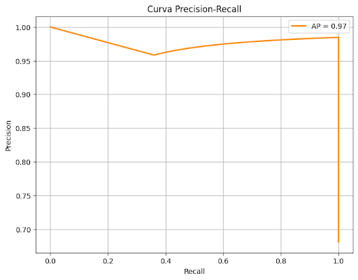

### **Figura 8**. Curva de Precisión y curva de Pérdida del modelo KERAS para la predicción del sentido del ataque ‘ray\_from\_above’.

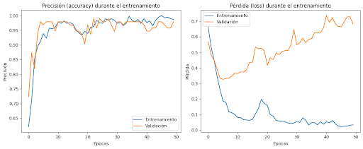

### **Figura 9**. Matriz de confusión del modelo KERAS para la predicción del sentido del ataque ‘ray\_from\_above’.

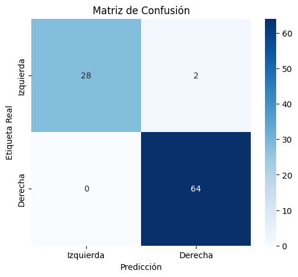

# Conclusiones

En resumen, este proyecto se centró en el desarrollo de un bot de inteligencia artificial capaz de derrotar a los jefes del Panteón en el videojuego Hollow Knight. El bot fue diseñado para identificar patrones en el juego y reaccionar de manera adecuada, utilizando la librería PyAutoGUI para ejecutar acciones dentro del juego. Se empleó el modelo YOLO para la detección de los personajes del juego, el cual demostró una alta precisión y recall en la detección tanto del personaje principal como del jefe y sus ataques en la mayoría de los casos. Las métricas clave, como la precisión, el recall y el mAP, evidenciaron la capacidad del modelo para aprender y mejorar a lo largo de las épocas de entrenamiento. Los ejemplos visuales proporcionaron una confirmación cualitativa del sólido rendimiento del modelo, aunque se identificaron desafíos en la detección consistente de ciertos tipos de ataques y en la diferenciación entre elementos visuales similares. El análisis de la matriz de confusión reveló una alta precisión en la detección del jefe, pero también cierta confusión entre elementos del fondo. Además de YOLO, se implementó un modelo Keras específicamente para predecir la dirección del ataque "ray\_from\_above", logrando una alta precisión y un Área Bajo la Curva de 0.97 en la curva Precisión-Recall, con una clasificación correcta para ambas direcciones con un número mínimo de errores.

En cuanto a la evaluación de los objetivos del proyecto, se logró implementar con éxito varios modelos de aprendizaje automático supervisado para la toma de decisiones en tiempo real dentro del juego. El rendimiento del bot se evaluó en diversos escenarios de combate, mostrando resultados prometedores en la detección del jefe y sus ataques, y particularmente exitoso en la predicción de la dirección de "ray\_from\_above". El proceso de desarrollo fue documentado de manera adecuada, y se utilizaron herramientas de visualización para analizar el desempeño del bot. En general, se alcanzó parcialmente el objetivo principal de desarrollar un bot capaz de derrotar a los jefes, ya que el modelo demostró una gran capacidad de detección y predicción de ataques específicos de un solo jefe, componentes cruciales para el éxito del bot.

No obstante, la implementación actual presenta ciertas limitaciones. El bot podría tener dificultades para generalizar a todos los escenarios de combate debido a la complejidad y variabilidad de los comportamientos del jefe. Si bien el modelo Keras para "ray\_from\_above" muestra un rendimiento excelente, la generalización a otros ataques y la comprensión integral de los patrones de comportamiento del jefe siguen siendo desafíos. El modelo YOLO mostró cierta dificultad para diferenciar entre elementos visuales similares en el entorno del juego. Además, se observó un ligero sobreajuste en el modelo Keras, lo que sugiere la necesidad de explorar técnicas de regularización. La dependencia de PyAutoGUI podría limitar la velocidad y precisión de las acciones en comparación con métodos más directos.

Para futuras investigaciones y mejoras, se sugiere enfocar los esfuerzos en perfeccionar la capacidad del modelo para predecir y reaccionar a una gama más amplia de jefes, expandiendo el uso de modelos específicos como Keras para otros. La exploración de arquitecturas avanzadas o técnicas de entrenamiento, incluyendo la consideración del contexto temporal en la predicción de ataques, podría mejorar la precisión y robustez. Investigar métodos para optimizar el proceso de toma de decisiones y la ejecución de acciones del bot, así como la aplicación de técnicas de regularización al modelo Keras, son áreas importantes para el futuro.

En una reflexión general, la aplicación de técnicas de IA y Big Data a Hollow Knight demuestra el potencial de estas tecnologías para crear agentes de juego sofisticados. La implementación exitosa de modelos específicos como el Keras para la predicción de ataques subraya el valor de combinar diferentes arquitecturas de modelos para abordar la complejidad del entorno del juego. El proyecto resalta tanto los desafíos como las recompensas de aplicar la IA en entornos complejos y dinámicos como los videojuegos. Si bien se lograron éxitos significativos en el desarrollo de un bot funcional con capacidades de detección y predicción de ataques, también se pone de manifiesto la necesidad continua de investigación y desarrollo para superar las limitaciones y mejorar aún más las capacidades de la IA en los juegos.

# Apéndices

### Fragmentos de código.

### Visualizaciones de datos adicionales. 

#### Lógica pricipal del bot

**Figura 10** Funciones de control del personaje principal.

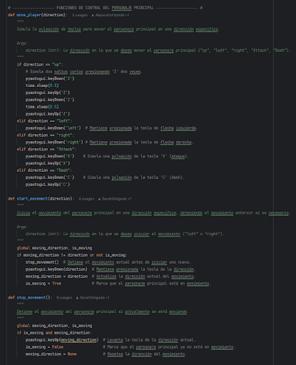

**Figura 11** Lógica de evasión del personaje principal.

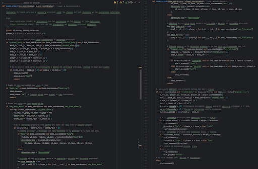

#### Lógica del reconocimiento de voz

**Figura 12** Lógica del reconocimiento de voz.

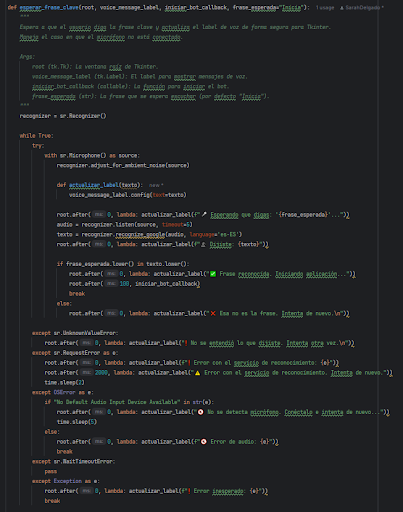

#### Lógica del estudio de la amenaza

**Figura 13** Lógica del estudio de la amenaza que representa el jefe para el personaje principal.

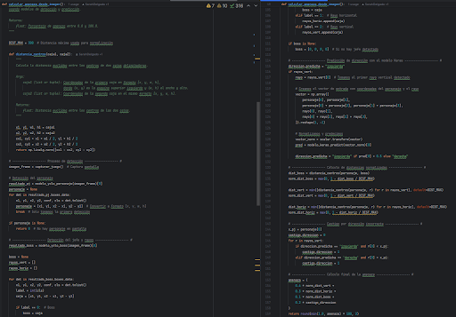

#### Modelo YOLO para la detección del personaje principal. 

**Figura 14** Evolución de las métricas del modelo durante el entrenamiento.

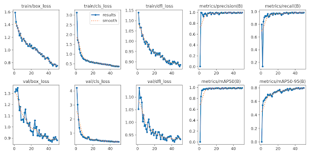

**Figura 15**. Análisis de correlación de las etiquetas de detección de objetos.

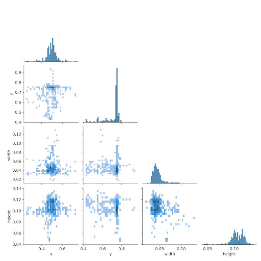

#### Modelo YOLO para la detección del jefe y sus ataques. 

**Figura 16** Evolución de las métricas del modelo durante el entrenamiento.

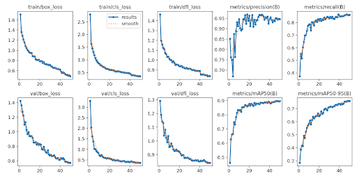

**Figura 17**. Análisis de correlación de las etiquetas de detección de objetos.

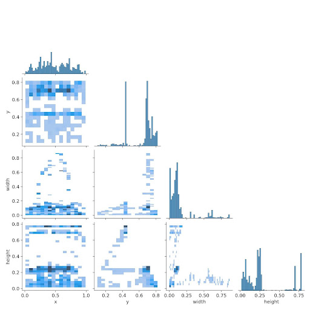

### Información sobre los miembros del equipo del proyecto y sus funciones. 

**Sarah Delgado Martin**
**Alejandro Fernández Morales**

# Repositorio

[https://github.com/SarahDelgado/Hollow-Bot](https://github.com/SarahDelgado/Hollow-Bot)

